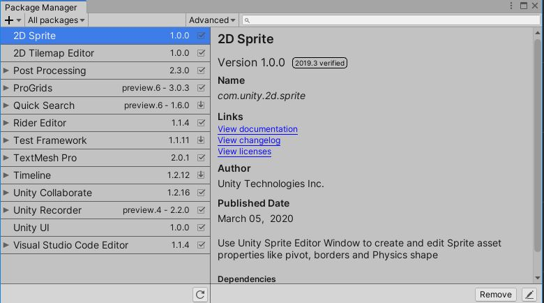

# Unity Packages

Unity is an extremely flexible piece of software. If you know from the interface, a lot of it's features are hidden in different windows.

Take a look at the Package Manager: Window > Package Manager.

What's more is that a lot of it's features can be entirely removed from Unity, or added.

## What Are Packages
Unity stores a lot of it's features in discreet plugins called "packages". They get updated independently from the version of Unity. 

> This means you can get updates and bug fixes without having to upgrade your project to a new version of Unity.

Packages are specific to your project. Packages that add features or change the editor will only be changed for that project you are working on.

>  It also means you have to worry about version compatibility. Uhg! "Use the newest stable version available" is a good rule-of-thumb. Many developers still tend not to update in the middle of working on a project that said, it's smart to look into release notes to see if there is a new feature or bug fix important to you. In doubt? Make a backup and test!

## Packages aren't just niche features

Looking through the list of packages, you will see a lot of things that almost certainly don't apply to your project. Like a neural net interface? (Barracuda) It would be reasonable to assume Unity hides away niche features from the general public, and thus you - still learning - could mostly ignore them. Wrong!

Unity stays as lightweight as it can, and most developers on most projects will need to go in and install at least one project.

> For example, I almost always install *Unity Recorder* for capturing video clips of my development progress. This packages is in preview, see the next section on **Preview Packages**.

Unity has a lot of it's amazing 2D features hidden away in packages, if you started with the standard "3D" template, they won't be enabled by default. Unity has some awesome tools for 2D game development, but you have to go to the package manager and install them!

## Preview Packages
Some of the coolest packages aren't quite ready for prime-time yet. They're still in development, basically. But some of the best packages (at the time of typing) are in beta. Show, and install them, under the "Advanced" dropdown.

.

For VR,

## Packages to look into:
Unity has some wonderful features hidden away in packages. Here are some of my favorites:

- Quick Search - *Stop clicking through menus or folders*
- Cinemachine - *Advanced camera control and sequencing*
- ProGrids - *Competent grid snapping*
- ProBuilder - *3D modeling right inside of Unity*
- XR Interaction Toolkit - *Very useful for prototyping VR interactions*
- Mathematics Library - *Math!*
- Unity Recorder (not "AOV recorder") - *Record and capture video clips from the editor*
- 2D Pixel Perfect - *Among many useful 2D utilities*

## Packages from Git
You aren't limited by Unity's offerings. You can also install packages from a git repository URL, most often one hosted on github. See the [manual](https://docs.unity3d.com/Manual/upm-ui-giturl.html) for more information.

## My Assets
Lastly, the Package Manager is where you can go and install packages or import assets you have purchased from the [asset store](https://assetstore.unity.com/). You can also do this from the in-unity browser, or a web browser. 
