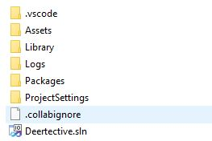
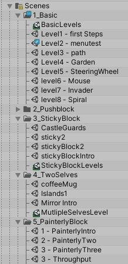
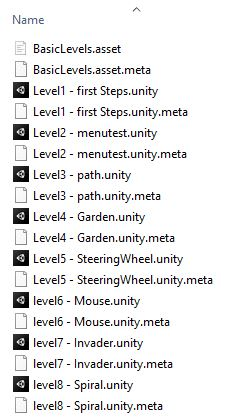

The following is also covered in this video overview.

<iframe width="560" height="315" src="https://www.youtube.com/embed/Omask191WxE" frameborder="0" allow="accelerometer; autoplay; encrypted-media; gyroscope; picture-in-picture" allowfullscreen></iframe>

# About Unity Projects
Unity projects are not single large files, like photoshop documents or pdfs. Instead they are folders. Inside of the folder contains all of the information that makes up the game. Some of these things are assets that are directly used, like 3D models, images, and sound files. A Unity Project is all contained in a single folder. 

## Unity Scene Files

Unity still has a file with a ".unity" file extension, and you can double click and open it in Unity. It's a scene file. It's a plaintext list of all of the scene settings and gameObjces, their components, and the serialzied properties those components have. (Go ahead and open one in a text editor. It's nothing fancy.)

A unity project can have tons of scenes! Often, each distinct level of a game is seperated by a scene.

So what file do you open when you open Unity? Unity can't be open without a scene being open (basically), so you always will open a specific scene. You can change which one is open, of course, but you can't *not* have a scene open. If this happens - such as if the previous open scene is renamed and you launch the editor - you will get a new default empty scene. "Oh no! All of my stuff is lost" you might think, before looking to see if your scene is actually open. 

## What Are These Folders?
There are a number of folders that will be included even when you create a completely empty project:

- Assets
- Library
- Logs
- Packages
- ProjectSettings

For the most part, the only folder you will need to be aware of outside of the unity editor is the Assets folder. All the other folders you either don't touch (Library), or you technically edit through the Unity Editor (ProjectSettings).

### Assets
Assets is where all of your *stuff* goes. See [What Are Assets](../fundamentals/what-are-assets.md) for more information. 

Generally, when you edit a Unity project, you're editing something in this folder.

When you start a blank project, this folder is blank! (Not true: it has 'Scenes' folder and a default empty scene). 

There is a universally common convention for organizing your assets folders into subfolders by type of asset. ie: "Scenes" "Scripts" "Models" "Materials".

#### .meta?
Unity will generate a '.meta' file for every asset. That's how it keeps track if you've made changes that need to be re-imported. Don't delete those!

> Note: If you delete a file outside of Unity, delete it's .meta file too.

### Library
Library is an automatically generated folder by Unity. It's full of meta data and temporary files that Unity generates when it "imports" assets into behind-the-scenes usable files. 

You can delete the library folder if you want to! Don't! but you can. If you do, Unity will have a long loading bar when you open the project next - it will re-import every asset. This can take a long time for big projects!

> Note: You can delete it to space on your backups and archived projects, perhaps. Or when moving a project to a new computer.

> You really do **not** want to include this folder when using source control software like git.

### Logs

Generally can be ignored.

Logs are plaintext files that store information when things update and so on. It takes up very little space and is used when hunting down errors and bugs.

### Packages
We know about [Packages](packages.md). But this folder is *not* all of the files and data in your packages. Instead, it's just a single JSON file that lists what specific packages you are using. Unity figures out the rest.

You can add a package to Unity by editing this file. That's kind of silly to do.

> I do know a developer friend who would have his "starter" project packages - packages he imported into almost every project - in a copy/paste manifest.json file, which was faster than importing each one through the UI.

### Project Settings
A simple folder where project specific settings are stored.

---

## Work On A Project Without Opening Unity

> *Some days I don't even launch Unity even though I'll work on a Unity project for hours, editing things in the assets folder.*

Because assets are just files on your computer, in many cases you can work on your unity project without ever opening Unity. Editing scripts, audio, textures, sprites, models, dialogue, and more can all be done from outside of Unity. If the asset Unity uses is just loading a file, then you can just edit that file in whatever program or piece of software you prefer.

> *PS: Unity has "importers" that allow you to save your working file - like ap Photoshop .psd file - right into the assets folder. Inside of Unity it will get treated like an image, but you can still directly edit the file with all it's layers and Photoshop goodness. It has these importers for a lot of 3D modeling software files, like .blend and .maya! Very useful for non destructive workflows.*
 
Knowing this can help with collaboration, as you can define roles. You can have some individuals are in charge of certain assets, and others may be in charge of bringing the assets into a unity scene, and not fear anybody overwriting anybody elses work.
