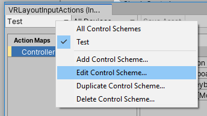
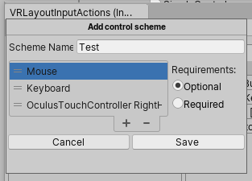

# Troubleshooting The New Input System in Unity

In 2019, Unity released the previous of their new Input System. This will replace the old system.

I have, through the most annoying kind of trial and error, come up with a checklist on setting up Input Actions.

First, you should look at the [official documentation](https://docs.unity3d.com/Packages/com.unity.inputsystem@1.0/manual/index.html) (for v.1.0, link may break).

They have not-very helpful tutorial:
<iframe width="560" height="315" src="https://www.youtube.com/embed/Gz0YcjXBJ3U" frameborder="0" allow="accelerometer; autoplay; encrypted-media; gyroscope; picture-in-picture" allowfullscreen></iframe>

and a much more helpful talk that introduces the system.

<iframe width="2543" height="1120" src="https://www.youtube.com/embed/hw3Gk5PoZ6A" frameborder="0" allow="accelerometer; autoplay; encrypted-media; gyroscope; picture-in-picture" allowfullscreen></iframe>

## Checklist for Input not showing up.

Using the "Player Input" component approach.

### Don't name your input Actions "InputActions"
This will override things and beef everything up. Whoops.

### Save changes to Input Actions.
Click Save, or check auto-save. 

### PlayerInput component won't automatically enable actions without a default map
In the PlayerInput component, we have options to set a default control scheme and a default map. If we don't select a default map, the actions will won't automatically get enabled in the debugger.

With default map set to "<None>", our input debugger looks like this.

So we just give it a default action so it will enable those when the PlayerInput component is initiated (ie: on awake).

We can also fix this with a script that does something like this:

using UnityEngine.InputSystem; //at the top of the file
...
GetComponent<PlayerInput>().actions.Enable();//inside Start or Awake

### Control Schemes need devices assigned to them

Look in the Input Debugger. Under the current User, does their control scheme list a number of devices, or is does it show an empty set of parenthesis?

compare that image to this one:

In the Input Actions window, we can go to "edit control scheme" by selecting a control scheme in the top left of the window, then selecting that same drop-down again. Make sure the control scheme has some devices.

Be sure there are devices in these options.

### For VR Development, make sure you don't have a menu up.
This one got me because the headset still passed position and tracking data to Unity, so I thought things were fine. The device was recognized, etc etc. Sadly, no. Button input being blocked because I had to set up the guardian, or whatever.

### Check what controllers are used in the action map
There are some devices that, when we add them to an action, look correct. They aren't.

